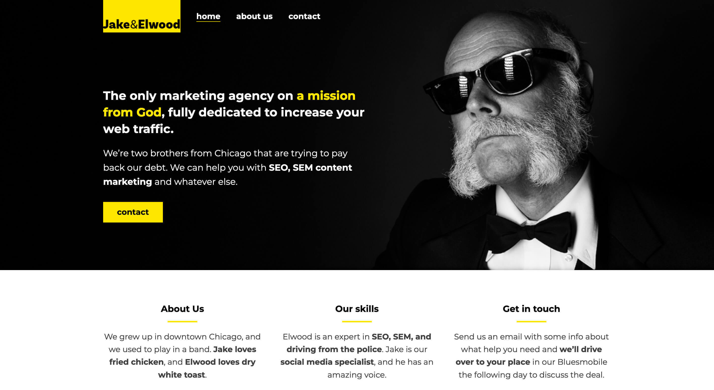

# Jake & Elwood

This is a project of the Scrimba [Responsive Web Design](https://scrimba.com/learn/responsive) course. The website feautures the basics of flexbox and viewport media queries. 

## About The Project 

The project aims to create a website using a mobile-first approach.

Live site: https://jake-elwood-by-alph-fonti.netlify.app/

## Built with

- Flexbox
- Grid
- Responsive Design

## Acknowledgments

- [Kevin Powell](https://www.youtube.com/kevinpowell)
